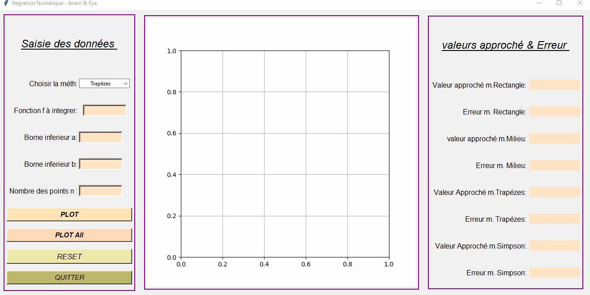

# Projet_AnalyseNumerique
## Intégration Numérique :
### À propos du projet:
Ce petit projet consiste à modéliser quatres méthodes d'intégration numériques avec une interface graphique réalisé à l’aide du « Tkinter ». 
Cette dernière vous permet de saisir la fonction, puis choisir les bornes d'intégrale (a et b) et fixer le nombre de subdivisons. Finalement, appuyer:
* Soit sur le bouton _**"plot"**_ : pour afficher le graphe de la méthode désirée, sa valeur d’intégrale et son erreur.
* Soit sur le bouton _**"plotAll"**_: pour afficher les quatre graphes relié à chaque méthode d’intégration l’intégrité des valeurs approchées des méthodes et leurs erreurs(qui représente la différence entre  la valeur exacte de l’intégrale et la valeur approchée donné par chaque méthode) 

Les méthodes d’intégrations étudiées dans ce projet : 

1. Méthode des Rectangles Gauches

2. Méthode des Trapèzes

3. Méthode des Points Milieux

4. Méthode de Simpson

#### Voici un démo sur la réalisation de l’interface graphique :

### Développé par :
Le langage Python 3 a été utilisé pour coder les différentes méthodes. Les bibliothèques utilisées sont principalement numpy et matplotlib et certaines parties du code nécessitent pylab.

Le projet est constitué des fichiers suivants:
* _**"IntegrationProject.py"**_ : contient le code source du projet.
* _**"Project.gif"**_  : contient un démo sur le projet.
* _**"Rapport.pdf"**_  : contient le rapport détaillé sur le projet.

### Documentation sur IntegrationProject.py:
Ce fichier contient 5 classes (class Rectangle,class Trapezoidal,class Simpson,class Milieu,class mclass) 
#### Documentation de la classe Rectangle
Cette classe permet la modélisation d’intégration par la méthodes des Rectangles Gauches.
#### Fonctionnement de la classe Rectangle
* Le constructeur de la classe se fait avec la fonction à intégrer, les valeurs des bornes d’intégrale et le nombre de subdivision en argument.
* Avant toutes autres étapes d’affichage, il faut calculer dans la classe rectangle la valeur d’intégrale. Pour cela, il y a la méthodes _**integrate**_. Cette dernière va être appelé dans la méthode _**Graph**_ qui est la méthode "de base" pour l’affichage.
* _**La méthode integrate**_ fait le calcul de la valeur d’intégrale  
* _**La méthode  Graph**_ trace la fonction à intégrer sur les points donnés en argument et retourne l'erreur et la valeur approchée d’intégrale de cette méthode

